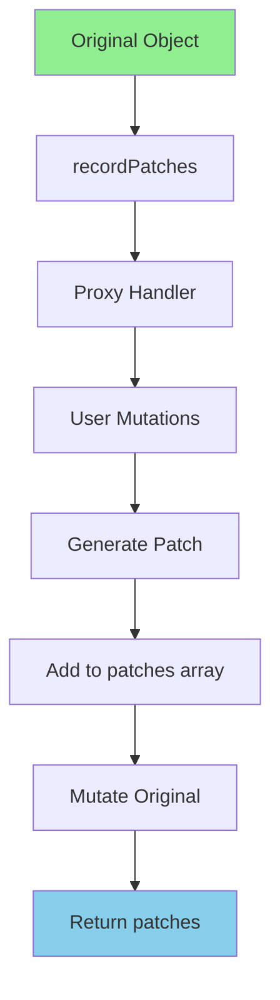

# patch-recorder Implementation Plan

## Overview

**patch-recorder** is a standalone JavaScript/TypeScript library that records JSON patches (RFC 6902) from mutations applied to objects, arrays, Maps, and Sets via a proxy interface. Unlike mutative or immer, it mutates the original object in place while recording changes, preserving object references and avoiding memory and computational overhead from copying.

## Key Features

- ✅ **Reference preservation** - Original object reference maintained
- ✅ **No memory overhead** - No copying of large arrays/objects
- ✅ **Accurate patches** - JSON Patch (RFC 6902) compliant
- ✅ **Type safety** - Full TypeScript support
- ✅ **Immediate patch generation** - Patches generated as mutations occur
- ✅ **Optional optimization** - Can compress/merge redundant patches

## Core Concept

```typescript
import {recordPatches} from 'patch-recorder';

const state = {
  user: { name: 'John', age: 30 },
  items: [1, 2, 3]
};

const patches = recordPatches(state, (draft) => {
  draft.user.name = 'Jane';
  draft.items.push(4);
});

console.log(state.user.name); // 'Jane' (mutated in place!)
console.log(patches); 
// [
//   { op: 'replace', path: ['user', 'name'], value: 'Jane' },
//   { op: 'add', path: ['items', 3], value: 4 }
// ]
```

## Architecture

### Component Overview



### Core Components

1. **Proxy Handler** - Intercepts get/set/delete operations
2. **Patch Generator** - Creates JSON patches immediately on mutation
3. **Array Handler** - Special handling for array methods (push, pop, splice, etc.)
4. **Map Handler** - Special handling for Map operations (set, delete, clear)
5. **Set Handler** - Special handling for Set operations (add, delete, clear)
6. **Patch Optimizer** - Optional compression of redundant patches

### Internal State Management

```typescript
interface RecorderState<T> {
  original: T;
  patches: Patches<true>;
  basePath: (string | number)[];
  options: {
    pathAsArray?: boolean;
    arrayLengthAssignment?: boolean;
    optimize?: boolean;
  };
}
```

## API Design

### Main Function

```typescript
export function recordPatches<T extends NonPrimitive>(
  state: T,
  mutate: (state: Draft<T>) => void,
  options?: RecordPatchesOptions
): Patches<true>
```

### Options

```typescript
export interface RecordPatchesOptions {
  
  /**
   * Return paths as arrays (default: true) or strings
   */
  pathAsArray?: boolean;
  
  /**
   * Include array length in patches (default: true)
   */
  arrayLengthAssignment?: boolean;
  
  /**
   * Optimize patches by merging redundant operations (default: false)
   */
  optimize?: boolean;
}
```

### Draft Type

```typescript
type Draft<T> = T;

// Draft is same as T at the type level
// The proxy provides draft behavior at runtime
```

## File Structure

```
patch-recorder/
├── src/
│   ├── index.ts              # Main export (recordPatches function)
│   ├── types.ts              # Type definitions
│   ├── proxy.ts              # Proxy handler implementation
│   ├── patches.ts            # Patch generation functions
│   ├── arrays.ts             # Array method handling
│   ├── maps.ts               # Map method handling
│   ├── sets.ts               # Set method handling
│   ├── optimizer.ts          # Patch optimization (optional)
│   └── utils.ts              # Utility functions
├── test/
│   ├── index.test.ts         # Main test suite
│   ├── arrays.test.ts        # Array-specific tests
│   ├── maps.test.ts          # Map-specific tests
│   ├── sets.test.ts          # Set-specific tests
│   ├── optimization.test.ts   # Optimization tests
│   └── comparison.test.ts    # Compare with mutative output
├── examples/
│   ├── basic.ts              # Basic usage examples
│   ├── arrays.ts             # Array operations
│   ├── nested.ts             # Nested objects
│   └── collections.ts        # Map/Set operations
├── package.json
├── tsconfig.json
├── vitest.config.ts
└── README.md
```

## Implementation Plan

### Phase 1: Core Infrastructure (~150 lines)

**File**: `src/types.ts`
- Define `NonPrimitive` type
- Define `Operation` enum
- Define `IPatch`, `Patch`, `Patches` types
- Define `RecordPatchesOptions` interface
- Define `RecorderState` interface

**File**: `src/utils.ts`
- Helper functions for path manipulation
- Type guards for objects/arrays/maps/sets
- Utility for checking if value is draftable

**File**: `src/index.ts`
- `recordPatches()` main function
- Initialize `RecorderState`
- Create root proxy
- Apply mutations
- Return patches

### Phase 2: Proxy Handler (~200 lines)

**File**: `src/proxy.ts`
- `createProxy()` function
- `get` handler - intercept property access, create nested proxies
- `set` handler - generate patch, mutate original
- `deleteProperty` handler - generate remove patch
- `has`, `ownKeys`, `getOwnPropertyDescriptor` handlers
- Handle special symbols (e.g., `[Symbol.iterator]`)

### Phase 3: Patch Generation (~100 lines)

**File**: `src/patches.ts`
- `generateSetPatch()` - for property assignments
- `generateDeletePatch()` - for property deletions
- `generateAddPatch()` - for new properties
- Path formatting (array vs string)
- Handle edge cases (undefined values, etc.)

### Phase 4: Array Support (~150 lines)

**File**: `src/arrays.ts`
- `handleArrayGet()` - intercept array method calls
- Array method wrappers for mutating methods:
  - `push` - generate add patches
  - `pop` - generate remove patch
  - `shift` - generate remove patch
  - `unshift` - generate add patches
  - `splice` - generate remove + add patches
  - `sort` - generate full replace patch
  - `reverse` - generate full replace patch
- Array length handling
- Array index access

### Phase 5: Map/Set Support (~150 lines)

**File**: `src/maps.ts`
- `handleMapGet()` - intercept Map method calls
- Map method wrappers:
  - `set` - generate add/replace patch
  - `delete` - generate remove patch
  - `clear` - generate remove patches for all entries

**File**: `src/sets.ts`
- `handleSetGet()` - intercept Set method calls
- Set method wrappers:
  - `add` - generate add patch
  - `delete` - generate remove patch
  - `clear` - generate remove patches for all entries

### Phase 6: Patch Optimization (Optional) (~100 lines)

**File**: `src/optimizer.ts`
- `compressPatches()` - merge redundant operations
- Remove no-op patches (same value)
- Merge consecutive operations on same path
- Remove patches that cancel each other out

### Phase 7: Testing & Validation (~500 lines)

**File**: `test/index.test.ts`
- Basic object mutations
- Nested object mutations
- Property deletion
- Type safety tests

**File**: `test/arrays.test.ts`
- Array method tests (push, pop, shift, unshift, splice)
- Array index assignment
- Array sort/reverse
- Array deletion

**File**: `test/maps.test.ts`
- Map set/delete/clear
- Nested Map operations
- Map patch accuracy

**File**: `test/sets.test.ts**
- Set add/delete/clear
- Set patch accuracy

**File**: `test/comparison.test.ts`
- Compare patch output with mutative
- Verify RFC 6902 compliance
- Edge case coverage

### Phase 8: Documentation & Examples (~200 lines)

**File**: `README.md`
- Installation instructions
- Usage examples
- API documentation
- Comparison with mutative
- Performance characteristics

**File**: `examples/*.ts`
- Basic usage
- Complex scenarios
- Integration examples

## Detailed Implementation

### 1. Types (src/types.ts)

```typescript
export type NonPrimitive = object | Array<unknown>;

export const Operation = {
  Remove: 'remove',
  Replace: 'replace',
  Add: 'add',
} as const;

export type PatchOp = (typeof Operation)[keyof typeof Operation];

export interface IPatch {
  op: PatchOp;
  value?: any;
  from?: (string | number)[];
}

export interface PatchesOptions {
  pathAsArray?: boolean;
  arrayLengthAssignment?: boolean;
}

export type Patch<P extends PatchesOptions = any> = P extends {
  pathAsArray: false;
}
  ? IPatch & { path: string }
  : P extends true | object
    ? IPatch & { path: (string | number)[] }
    : IPatch & { path: string | (string | number)[] };

export type Patches<P extends PatchesOptions = any> = Patch<P>[];

export interface RecordPatchesOptions {
  pathAsArray?: boolean;
  arrayLengthAssignment?: boolean;
  optimize?: boolean;
}

export type Draft<T> = T;

interface RecorderState<T> {
  original: T;
  patches: Patches<any>;
  basePath: (string | number)[];
  options: RecordPatchesOptions & { internalPatchesOptions: PatchesOptions };
}
```

### 2. Main Function (src/index.ts)

```typescript
import {createProxy} from './proxy';
import type {NonPrimitive, Draft, RecordPatchesOptions, Patches} from './types';

export function recordPatches<T extends NonPrimitive>(
  state: T,
  mutate: (state: Draft<T>) => void,
  options: RecordPatchesOptions = {}
): Patches<true> {
  const internalPatchesOptions: any = {
    pathAsArray: options.pathAsArray ?? true,
    arrayLengthAssignment: options.arrayLengthAssignment ?? true,
  };

  const recorderState = {
    original: state,
    patches: [],
    basePath: [],
    options: {
      ...options,
      internalPatchesOptions,
    },
  };

  // Create proxy
  const proxy = createProxy(state, [], recorderState) as Draft<T>;

  // Apply mutations
  mutate(proxy);

  // Return patches (optionally optimized)
  if (options.optimize) {
    const {compressPatches} = require('./optimizer');
    return compressPatches(recorderState.patches);
  }

  return recorderState.patches as Patches<true>;
}

// Re-export types
export type {NonPrimitive, Draft, RecordPatchesOptions, Patches, Patch, IPatch, Operation} from './types';
```

### 3. Proxy Handler (src/proxy.ts)

```typescript
import type {RecorderState} from './types';
import {generateSetPatch, generateDeletePatch, generateAddPatch} from './patches';
import {handleArrayGet} from './arrays';
import {handleMapGet} from './maps';
import {handleSetGet} from './sets';

export function createProxy<T extends object>(
  target: T,
  path: (string | number)[],
  state: RecorderState<any>
): T {
  const isArray = Array.isArray(target);
  const isMap = target instanceof Map;
  const isSet = target instanceof Set;

  const handler: ProxyHandler<T> = {
    get(obj, prop) {
      // Handle special methods for collections
      if (isArray && typeof prop === 'string') {
        return handleArrayGet(obj as any[], prop, path, state);
      }

      if (isMap && typeof prop === 'string') {
        return handleMapGet(obj as Map<any, any>, prop, path, state);
      }

      if (isSet && typeof prop === 'string') {
        return handleSetGet(obj as Set<any>, prop, path, state);
      }

      // Handle property access
      const value = (obj as any)[prop];

      // Create nested proxy for draftable values
      if (typeof value === 'object' && value !== null) {
        return createProxy(value, [...path, prop], state);
      }

      return value;
    },

    set(obj, prop, value) {
      const oldValue = (obj as any)[prop];
      const propPath = [...path, prop];

      // Skip if no actual change
      if (oldValue === value) {
        return true;
      }

      // Mutate original immediately
      (obj as any)[prop] = value;

      // Generate patch
      if (oldValue === undefined) {
        generateAddPatch(state, propPath, value);
      } else {
        generateSetPatch(state, propPath, oldValue, value);
      }
      
      return true;
    },

    deleteProperty(obj, prop) {
      const oldValue = (obj as any)[prop];
      const propPath = [...path, prop];

      if (oldValue !== undefined) {
        delete (obj as any)[prop];

        // Generate patch
        generateDeletePatch(state, propPath, oldValue);
      }

      return true;
    },

    has(obj, prop) {
      return prop in obj;
    },

    ownKeys(obj) {
      return Reflect.ownKeys(obj);
    },

    getOwnPropertyDescriptor(obj, prop) {
      const descriptor = Reflect.getOwnPropertyDescriptor(obj, prop);
      if (!descriptor) return descriptor;

      return {
        ...descriptor,
        writable: true,
        configurable: true,
      };
    },

    getPrototypeOf(obj) {
      return Reflect.getPrototypeOf(obj);
    },
  };

  return new Proxy(target, handler);
}
```

### 4. Patch Generation (src/patches.ts)

```typescript
import type {RecorderState, PatchOp} from './types';
import {Operation} from './types';

export function generateSetPatch(
  state: RecorderState<any>,
  path: (string | number)[],
  oldValue: any,
  newValue: any
) {
  const patch = {
    op: Operation.Replace,
    path: formatPath(path, state.options),
    value: newValue,
  };

  state.patches.push(patch);
}

export function generateDeletePatch(
  state: RecorderState<any>,
  path: (string | number)[],
  oldValue: any
) {
  const patch = {
    op: Operation.Remove,
    path: formatPath(path, state.options),
  };

  state.patches.push(patch);
}

export function generateAddPatch(
  state: RecorderState<any>,
  path: (string | number)[],
  value: any
) {
  const patch = {
    op: Operation.Add,
    path: formatPath(path, state.options),
    value,
  };

  state.patches.push(patch);
}

export function generateReplacePatch(
  state: RecorderState<any>,
  path: (string | number)[],
  value: any
) {
  const patch = {
    op: Operation.Replace,
    path: formatPath(path, state.options),
    value,
  };

  state.patches.push(patch);
}

function formatPath(
  path: (string | number)[],
  options: { internalPatchesOptions: { pathAsArray?: boolean } }
): string | (string | number)[] {
  if (options.internalPatchesOptions.pathAsArray === false) {
    // Convert to JSON Pointer string format
    return path
      .map((part) => {
        if (typeof part === 'number') {
          return String(part);
        }
        return '/' + part.replace(/~/g, '~0').replace(/\//g, '~1');
      })
      .join('');
  }

  return path;
}
```

### 5. Array Handler (src/arrays.ts)

```typescript
import type {RecorderState} from './types';
import {createProxy} from './proxy';
import {Operation} from './types';
import {generateAddPatch, generateDeletePatch, generateReplacePatch} from './patches';

export function handleArrayGet(
  obj: any[],
  prop: string,
  path: (string | number)[],
  state: RecorderState<any>
): any {
  // Mutating methods
  const mutatingMethods = ['push', 'pop', 'shift', 'unshift', 'splice', 'sort', 'reverse'];

  if (mutatingMethods.includes(prop)) {
    return (...args: any[]) => {
      const oldValue = [...obj]; // Snapshot before mutation
      const result = (Array.prototype as any)[prop].apply(obj, args);

      // Generate patches based on the method
      generateArrayPatches(state, obj, prop, args, result, path, oldValue);

      return result;
    };
  }

  // Non-mutating methods
  const nonMutatingMethods = [
    'map', 'filter', 'reduce', 'reduceRight',
    'forEach', 'find', 'findIndex', 'some', 'every',
    'includes', 'indexOf', 'lastIndexOf', 'slice',
    'concat', 'join', 'flat', 'flatMap', 'at'
  ];

  if (nonMutatingMethods.includes(prop)) {
    return (Array.prototype as any)[prop].bind(obj);
  }

  // Property access
  if (prop === 'length') {
    return obj.length;
  }

  const value = obj[prop as any];

  // Create nested proxy for object elements
  if (typeof value === 'object' && value !== null && typeof prop === 'number') {
    return createProxy(value, [...path, prop], state);
  }

  return value;
}

function generateArrayPatches(
  state: RecorderState<any>,
  obj: any[],
  method: string,
  args: any[],
  result: any,
  path: (string | number)[],
  oldValue: any[]
) {
  switch (method) {
    case 'push':
      args.forEach((value, i) => {
        const index = obj.length - args.length + i;
        generateAddPatch(state, [...path, index], value);
      });
      break;

    case 'pop':
      const popIndex = obj.length;
      generateDeletePatch(state, [...path, popIndex - 1], result);
      break;

    case 'shift':
      generateDeletePatch(state, [...path, 0], result);
      // Remaining elements shift - this is complex, may need full replace
      // For simplicity, we might need to replace the entire array
      if (state.options.arrayLengthAssignment !== false) {
        generateReplacePatch(state, path, [...obj]);
      }
      break;

    case 'unshift':
      args.forEach((value, i) => {
        generateAddPatch(state, [...path, i], value);
      });
      break;

    case 'splice':
      const [start, deleteCount, ...addItems] = args;

      // Generate remove patches for deleted items
      for (let i = 0; i < deleteCount; i++) {
        generateDeletePatch(state, [...path, start], oldValue[start + i]);
      }

      // Generate add patches for new items
      addItems.forEach((item, i) => {
        generateAddPatch(state, [...path, start + i], item);
      });
      break;

    case 'sort':
    case 'reverse':
      // These reorder the entire array - generate full replace
      generateReplacePatch(state, path, [...obj]);
      break;
  }
}
```

### 6. Map Handler (src/maps.ts)

```typescript
import type {RecorderState} from './types';
import {createProxy} from './proxy';
import {Operation} from './types';
import {generateAddPatch, generateDeletePatch, generateReplacePatch} from './patches';

export function handleMapGet(
  obj: Map<any, any>,
  prop: string,
  path: (string | number)[],
  state: RecorderState<any>
): any {
  // Mutating methods
  if (prop === 'set') {
    return (key: any, value: any) => {
      const oldValue = obj.get(key);
      const result = obj.set(key, value);

      // Generate patch
      const itemPath = [...path, key];

      if (oldValue === undefined) {
        generateAddPatch(state, itemPath, value);
      } else {
        generateReplacePatch(state, itemPath, value);
      }
      
      return result;
    };
  }

  if (prop === 'delete') {
    return (key: any) => {
      const oldValue = obj.get(key);
      const result = obj.delete(key);

      if (result) {
        const itemPath = [...path, key];
        generateDeletePatch(state, itemPath, oldValue);
      }

      return result;
    };
  }

  if (prop === 'clear') {
    return () => {
      const entries = Array.from(obj.entries());
      obj.clear();

      entries.forEach(([key]) => {
        const itemPath = [...path, key];
        generateDeletePatch(state, itemPath, key);
      });
    };
  }

  // Non-mutating methods
  const nonMutatingMethods = ['get', 'has', 'keys', 'values', 'entries', 'forEach'];

  if (nonMutatingMethods.includes(prop)) {
    return (obj as any)[prop].bind(obj);
  }

  if (prop === 'size') {
    return obj.size;
  }

  return (obj as any)[prop];
}
```

### 7. Set Handler (src/sets.ts)

```typescript
import type {RecorderState} from './types';
import {createProxy} from './proxy';
import {Operation} from './types';
import {generateAddPatch, generateDeletePatch} from './patches';

export function handleSetGet(
  obj: Set<any>,
  prop: string,
  path: (string | number)[],
  state: RecorderState<any>
): any {
  if (prop === 'add') {
    return (value: any) => {
      const existed = obj.has(value);
      const result = obj.add(value);

      if (!existed) {
        const itemPath = [...path, value];
        generateAddPatch(state, itemPath, value);
      }

      return result;
    };
  }

  if (prop === 'delete') {
    return (value: any) => {
      const existed = obj.has(value);
      const result = obj.delete(value);

      if (existed) {
        const itemPath = [...path, value];
        generateDeletePatch(state, itemPath, value);
      }

      return result;
    };
  }

  if (prop === 'clear') {
    return () => {
      const values = Array.from(obj.values());
      obj.clear();

      values.forEach((value) => {
        const itemPath = [...path, value];
        generateDeletePatch(state, itemPath, value);
      });
    };
  }

  // Non-mutating methods
  const nonMutatingMethods = ['has', 'keys', 'values', 'entries', 'forEach'];

  if (nonMutatingMethods.includes(prop)) {
    return (obj as any)[prop].bind(obj);
  }

  if (prop === 'size') {
    return obj.size;
  }

  return (obj as any)[prop];
}
```

### 8. Patch Optimizer (src/optimizer.ts)

```typescript
import type {Patches} from './types';

export function compressPatches(patches: Patches<true>): Patches<true> {
  const compressed: any[] = [];

  for (let i = 0; i < patches.length; i++) {
    const patch = patches[i];

    // Skip no-op patches (same value)
    if (patch.op === 'replace') {
      const previous = compressed[compressed.length - 1];
      if (previous && 
          JSON.stringify(previous.path) === JSON.stringify(patch.path) &&
          previous.op === 'replace' &&
          JSON.stringify(previous.value) === JSON.stringify(patch.value)) {
        continue;
      }
    }

    // Merge consecutive operations on same path
    if (i > 0) {
      const prevPatch = patches[i - 1];
      if (prevPatch.path.length > 0 && 
          JSON.stringify(prevPatch.path) === JSON.stringify(patch.path)) {
        // Replace with latest value
        compressed[compressed.length - 1] = patch;
        continue;
      }
    }

    compressed.push(patch);
  }

  return compressed as Patches<true>;
}
```

## Testing Strategy

### Test Categories

1. **Basic Functionality**
   - Simple object mutations
   - Property assignment
   - Property deletion
   - Nested object mutations

2. **Array Operations**
   - All array methods (push, pop, shift, unshift, splice)
   - Array index assignment
   - Array deletion
   - Array sort/reverse
   - Nested arrays

3. **Collection Operations**
   - Map set/delete/clear
   - Set add/delete/clear
   - Nested collections

4. **Patch Accuracy**
   - Compare with mutative output
   - RFC 6902 compliance
   - Path formatting (array vs string)

5. **Edge Cases**
   - Undefined values
   - Null values
   - Symbol keys
   - Circular references (if supported)
   - Deep nesting

6. **Type Safety**
   - TypeScript compilation
   - Type inference
   - Generic type parameters

7. **Optimization**
   - Patch compression
   - Redundant patch removal

### Test Example

```typescript
import {describe, it, expect} from 'vitest';
import {recordPatches} from '../src/index';

describe('recordPatches', () => {
  it('should record simple object mutation', () => {
    const state = { user: { name: 'John', age: 30 } };

    const patches = recordPatches(state, (draft) => {
      draft.user.name = 'Jane';
    });

    expect(state.user.name).toBe('Jane'); // Mutated in place
    expect(patches).toEqual([
      { op: 'replace', path: ['user', 'name'], value: 'Jane' }
    ]);
  });

  it('should record array push', () => {
    const state = { items: [1, 2, 3] };

    const patches = recordPatches(state, (draft) => {
      draft.items.push(4);
    });

    expect(state.items).toEqual([1, 2, 3, 4]);
    expect(patches).toEqual([
      { op: 'add', path: ['items', 3], value: 4 }
    ]);
  });
});
```

## Performance Considerations

### Memory Usage

- **No copying**: Original object mutated in place
- **Patch storage**: Only patches array stored (minimal overhead)
- **Proxy creation**: One proxy per object accessed during mutation

### Time Complexity

- **Property access**: O(1) for direct access, O(1) for proxy
- **Property mutation**: O(1) + patch generation
- **Array operations**: O(n) for some operations (same as native)
- **Nested mutations**: O(depth) for proxy creation

### Optimization Opportunities

1. **Lazy proxy creation**: Only create proxies for accessed properties
2. **Patch compression**: Reduce redundant patches
3. **Skip patch generation**: If patches not needed (optimization mode)
4. **Path caching**: Cache formatted paths

## Comparison with Mutative

| Feature | Mutative | patch-recorder |
|---------|----------|----------------|
| Reference preservation | No (creates copy) | ✅ Yes (mutates in place) |
| Memory overhead | Yes (copies) | No |
| Patch accuracy | ✅ Excellent | ✅ Excellent |
| Type safety | ✅ Excellent | ✅ Excellent |
| API similarity | Similar | Similar |
| Use case | Immutable state | Mutable with tracking |

## Integration Example

### With mutative-store

```typescript
// Before (with mutative)
import {create} from 'mutative';

const [newState, patches] = create(this.state[key], mutate, {
  enablePatches: true,
});
this.state[key] = newState;

// After (with patch-recorder)
import {recordPatches} from 'patch-recorder';

const patches = recordPatches(this.state[key], mutate, {
  enablePatches: true,
});
// this.state[key] already mutated in place!
```

## Success Criteria

- ✅ All tests pass
- ✅ Patches match mutative's output (where applicable)
- ✅ RFC 6902 compliant
- ✅ TypeScript compilation succeeds
- ✅ No memory leaks (proper proxy handling)
- ✅ Performance better than mutative for large objects
- ✅ Documentation complete
- ✅ Examples provided

## Estimated Effort

- **Core implementation**: ~3-4 days
- **Testing**: ~2-3 days
- **Documentation**: ~1 day
- **Total**: ~6-8 days

## Risks & Mitigations

| Risk | Mitigation |
|------|------------|
| Patch accuracy vs mutative | Comprehensive comparison tests |
| Edge cases in array methods | Extensive array testing |
| Memory leaks | Proper proxy management |
| Type safety issues | Strict TypeScript configuration |
| Performance regression | Benchmarking at each phase |

## Next Steps

1. **Initialize project** - Set up package.json, tsconfig, etc.
2. **Implement Phase 1** - Types and main function
3. **Implement Phase 2-3** - Proxy handler and patch generation
4. **Test basic functionality** - Verify simple mutations work
5. **Implement Phase 4-5** - Array and collection support
6. **Comprehensive testing** - All test suites
7. **Documentation** - README and examples
8. **Performance benchmarking** - Compare with mutative
9. **Release** - Publish to npm