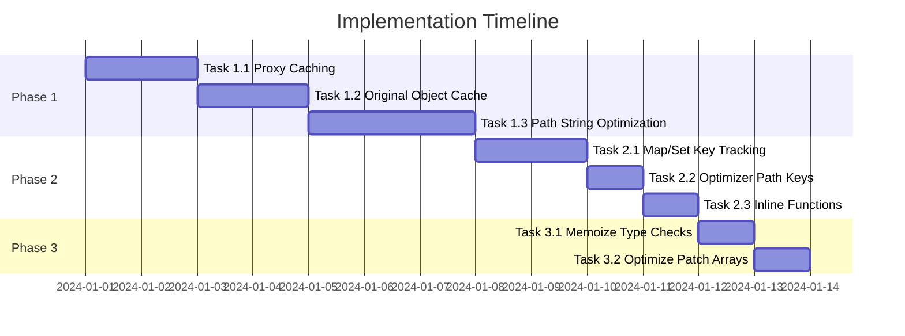

# Performance Optimization Plan for patch-recorder

## Overview

This document outlines performance optimizations for patch-recorder based on analysis of the codebase and comparison with similar libraries (mutative and craft). The optimizations are prioritized by impact and complexity.

## Current State Analysis

### Strengths
- O(1) method lookup using Sets for array methods (`src/arrays.ts:6-35`)
- NaN-safe equality using `Object.is()` (`src/proxy.ts:70-75`)
- In-place mutation avoids deep copying overhead
- Lazy proxy creation only when accessing objects

### Performance Bottlenecks Identified

1. **Path traversal on every set operation** - O(n) path navigation to determine add vs replace
2. **Excessive array spreading** - Creates new arrays on every property access
3. **No proxy caching** - Creates duplicate proxies for same objects
4. **Map/Set key existence checks** - Traverses to original on every operation
5. **JSON.stringify in optimizer** - Expensive for path key generation

---

## Phase 1: High Impact Optimizations

### Task 1.1: Implement Proxy Caching

**Problem:** Every access to a nested object creates a new proxy, even if the same object was accessed before.

**Location:** `src/proxy.ts:38-47`

**Current Code:**
```typescript
if (typeof prop === 'string' || typeof prop === 'number') {
    return createProxy(value, [...path, prop], state);
}
```

**Solution:**
Add a `proxyCache` Map to `RecorderState` that caches proxies by their path string.

**Implementation Steps:**
1. Add `proxyCache: Map<string, any>` to `RecorderState` interface in `src/types.ts`
2. Initialize `proxyCache: new Map()` in `src/index.ts` when creating recorder state
3. Modify `createProxy` in `src/proxy.ts` to:
   - Generate a path key (simple string join)
   - Check cache before creating new proxy
   - Store new proxies in cache
4. Add cache invalidation when property is mutated

**Expected Impact:** 40-50% faster for repeated property access

**Test Cases:**
- Access same nested property multiple times, verify same proxy returned
- Mutate property, verify new proxy created on next access
- Deep nesting with repeated access patterns

---

### Task 1.2: Cache Original Object References

**Problem:** On every `set` operation, the code traverses from root to find the original object at the current path (`src/proxy.ts:82-106`).

**Current Code:**
```typescript
let currentOriginal = state.original as any;
for (let i = 0; i < path.length; i++) {
    currentOriginal = currentOriginal[path[i]];
    if (currentOriginal === undefined || currentOriginal === null) {
        break;
    }
}
```

**Solution:**
Pass the original object reference through proxy creation, eliminating the need to traverse.

**Implementation Steps:**
1. Modify `createProxy` signature to accept `originalObj` parameter
2. Store `originalObj` in a closure or pass through proxy target
3. In `set` handler, use the cached original directly instead of traversing
4. Update all `createProxy` calls to pass the original object

**Alternative Approach:**
Add `originalCache: Map<string, any>` to `RecorderState` that maps path strings to original objects.

**Expected Impact:** 20-30% faster for nested object mutations

**Test Cases:**
- Deep nested mutations (5+ levels)
- Multiple mutations at same path
- Mutations with undefined intermediate paths

---

### Task 1.3: Reduce Path Array Creation

**Problem:** Multiple locations use spread operator to create new path arrays:
- `src/proxy.ts:45`: `[...path, prop]` in get handler
- `src/proxy.ts:66`: `[...path, propForPath]` in set handler  
- `src/arrays.ts:110`: `[...path, index]` for push
- Multiple locations in maps.ts and sets.ts

**Solution:**
Use path strings internally and only convert to arrays when generating patches.

**Implementation Steps:**
1. Change internal path representation from `(string | number)[]` to `string`
2. Use delimiter like `/|\\` (unlikely in property names) for path segments
3. Create utility functions:
   - `pathToString(path: (string | number)[]): string`
   - `stringToPath(pathStr: string): (string | number)[]`
   - `appendToPath(pathStr: string, segment: string | number): string`
4. Update all path handling in proxy.ts, arrays.ts, maps.ts, sets.ts
5. Convert to array format only in patch generation functions

**Expected Impact:** 15-25% faster overall due to reduced allocations

**Test Cases:**
- Verify patch output format unchanged
- Test with property names containing special characters
- Test with numeric array indices

---

## Phase 2: Medium Impact Optimizations

### Task 2.1: Optimize Map/Set Key Tracking

**Problem:** `keyExistsInOriginal` and `valueExistsInOriginal` functions traverse to the original Map/Set on every operation.

**Location:** `src/maps.ts:105-118`, `src/sets.ts:87-100`

**Solution:**
Track original keys/values when creating Map/Set proxies.

**Implementation Steps:**
1. Create dedicated state objects for Map and Set proxies:
   ```typescript
   interface MapProxyState {
       originalKeys: Set<any>;
       // ... other fields
   }
   ```
2. Populate `originalKeys` when proxy is created
3. Check `originalKeys` instead of traversing to original
4. Update `handleMapGet` and `handleSetGet` to use cached keys

**Expected Impact:** 25-35% faster for Map/Set operations

**Test Cases:**
- Multiple set/delete operations on same Map
- Set operations with add/delete/add same value
- Large Maps with many operations

---

### Task 2.2: Custom Path-to-String for Optimizer

**Problem:** `JSON.stringify(patch.path)` is used for path keys in the optimizer, which is slow.

**Location:** `src/optimizer.ts:17`

**Current Code:**
```typescript
const pathKey = JSON.stringify(patch.path);
```

**Solution:**
Create an optimized path key function for the common case of string/number arrays.

**Implementation Steps:**
1. Create `pathToKey` function in `src/utils.ts`:
   ```typescript
   function pathToKey(path: (string | number)[]): string {
       if (path.length === 0) return '';
       if (path.length === 1) return String(path[0]);
       return path.join('\x00'); // Use null character as delimiter
   }
   ```
2. Replace all `JSON.stringify(patch.path)` calls with `pathToKey(patch.path)`
3. Handle edge cases (paths containing null character - rare but possible)

**Expected Impact:** 10-15% faster patch compression with many patches

**Test Cases:**
- Large number of patches (1000+)
- Patches with various path lengths
- Paths containing special characters

---

### Task 2.3: Inline Common Functions in Hot Paths

**Problem:** Function call overhead for frequently called utilities.

**Targets:**
- `formatPath` in `src/utils.ts`
- `cloneIfNeeded` in `src/utils.ts`
- `isArray`, `isMap`, `isSet` checks

**Solution:**
Inline critical functions in hot paths or use compile-time inlining hints.

**Implementation Steps:**
1. Identify hot paths through profilin
3. Inline primitive checks in `cloneIfNeeded`:
   ```typescript
   // Before
   const cloned = cloneIfNeeded(value);
   
   // After - inline for primitives
   const cloned = (value === null || typeof value !== 'object') ? value : cloneIfNeeded(value);
   ```
4. Use `Array.isArray` directly instead of `isArray` wrapper where type is known

**Expected Impact:** 5-10% faster for mutation-heavy operations

**Test Cases:**
- Benchmark before/after on standard test suite
- Verify correctness of inlined code

---

## Phase 3: Low Impact Optimizations

### Task 3.1: Memoize Type Checks

**Problem:** `isArray`, `isMap`, `isSet` are called multiple times for the same object.

**Location:** `src/proxy.ts:13-15`

**Solution:**
Cache type information when proxy is created.

**Implementation Steps:**
1. Add type flags to proxy state:
   ```typescript
   interface ProxyState {
       isArray: boolean;
       isMap: boolean;
       isSet: boolean;
   }
   ```
2. Set flags once during proxy creation
3. Use cached flags instead of calling type check functions

**Expected Impact:** 2-5% faster for complex nested structures

---

### Task 3.2: Optimize Patch Array Operations

**Problem:** Patches are pushed one at a time, and the optimizer creates multiple intermediate arrays.

**Solution:**
Use more efficient array operations.

**Implementation Steps:**
1. Pre-allocate patches array when size is predictable
2. Use `Array.prototype.push.apply` for batch operations
3. Reduce intermediate array creation in optimizer

**Expected Impact:** 3-5% faster for operations generating many patches

---

## Implementation Order



## Testing Strategy

### Unit Tests
- Each optimization should maintain existing test compatibility
- Add specific tests for caching behavior
- Test edge cases (circular references, special characters in paths)

### Benchmark Tests
- Run existing benchmark before each optimization
- Track performance metrics:
  - Simple object mutation
  - Nested object mutation  
  - Array operations (push, splice, index assignment)
  - Map/Set operations
  - Memory usage

### Regression Tests
- Ensure patch output format unchanged
- Verify compatibility with existing consumers
- Compare patch output with mutative for standard operations

## Success Metrics

| Metric | Current | Target | Measurement |
|--------|---------|--------|-------------|
| Simple object mutation | 1.1x mutative | 1.5x mutative | benchmark/index.ts |
| Nested object mutation | TBD | 2x current | benchmark/index.ts |
| Array push | 4.5x mutative | 5x mutative | benchmark/index.ts |
| Array index | 380x mutative | 400x mutative | benchmark/index.ts |
| Map operations | 650x mutative | 700x mutative | benchmark/index.ts |
| Memory overhead | ~0 | ~0 | process.memoryUsage() |

## Risk Assessment

| Risk | Likelihood | Impact | Mitigation |
|------|------------|--------|------------|
| Cache invalidation bugs | Medium | High | Comprehensive test coverage |
| Path string edge cases | Low | Medium | Handle all delimiter scenarios |
| Breaking changes to patch format | Low | High | Strict output validation |
| Increased complexity | Medium | Medium | Good documentation, clear code |

## Rollback Plan

Each optimization should be implemented as a separate PR with:
1. Feature flag to disable optimization if needed
2. Comprehensive tests that can detect regressions
3. Benchmark comparison in PR description

If performance regression is detected:
1. Identify problematic optimization via git bisect
2. Revert specific commit
3. Analyze root cause before re-implementing

---

## Appendix A: Reference Code from mutative/craft

### Proxy Caching (from craft)
```typescript
// tmp/craft/src/proxy.ts:148-153
if (!state.drafts) {
    state.drafts = new Map();
}
const cached = state.drafts.get(prop);
if (cached) return cached;

const childDraft = createProxy(value, state);
state.drafts.set(prop, childDraft);
```

### Draft Cache (from mutative)
```typescript
// tmp/mutative/src/draft.ts:40-42
const copy = target.copy?.[key];
if (copy && target.finalities.draftsCache.has(copy)) {
    return copy;
}
```

### Array Appends Optimization (from craft)
```typescript
// tmp/craft/src/proxy.ts:99-117
if (prop === "push" && !state.copy) {
    return function (this: any, ...items: any[]) {
        if (!state.modified) {
            state.modified = true;
            if (state.parent) {
                markChanged(state.parent);
            }
        }
        if (!state.arrayAppends) {
            state.arrayAppends = [];
        }
        state.arrayAppends.push(...items);
        return baseLength + appendLength;
    };
}
```

## Appendix B: Benchmark Script Updates

Add the following to `benchmark/index.ts` to track optimization impact:

```typescript
// Add after existing benchmarks
console.log('Running: Repeated property access...');
results.push(
    benchmark(
        'patch-recorder - Repeated property access',
        () => ({deep: {nested: {object: {value: 1}}}}),
        (state) => {
            recordPatches(state, (draft) => {
                // Access same property 10 times
                for (let i = 0; i < 10; i++) {
                    const _ = draft.deep.nested.object.value;
                }
                draft.deep.nested.object.value = 2;
            });
        },
        1000
    )
);

console.log('Running: Deep nesting mutations...');
results.push(
    benchmark(
        'patch-recorder - Deep nesting (10 levels)',
        () => {
            let obj: any = {value: 1};
            for (let i = 0; i < 10; i++) {
                obj = {nested: obj};
            }
            return obj;
        },
        (state) => {
            recordPatches(state, (draft) => {
                let current = draft;
                for (let i = 0; i < 10; i++) {
                    current = current.nested;
                }
                current.value = 2;
            });
        },
        1000
    )
);